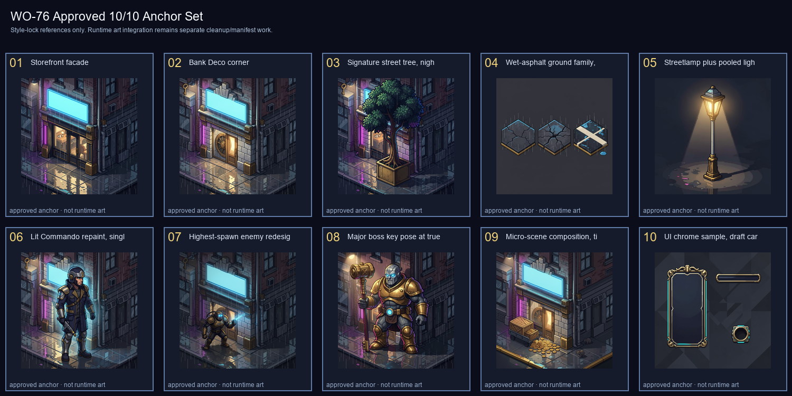

# Hard Money Heroes WO-76 Anchor Set

**Full anchor set status: APPROVED — 10/10 slots approved.**

This document is the style-lock registry for WO-76. All ten anchors have approved winners and provenance. These are style/reference anchors only; runtime integration still requires crop/alpha/palette cleanup, manifests, and per-work-order QA.

## Approved anchors

| # | Slot | Anchor | Provenance |
|---|---|---|---|
| 01 | Storefront facade | `docs/art/anchors/storefront-facade.png` | `docs/art/anchors/storefront-facade.provenance.json` |
| 02 | Bank-district Deco corner facade | `docs/art/anchors/bank-deco-corner.png` | `docs/art/anchors/bank-deco-corner.provenance.json` |
| 03 | Signature street tree, night-lit in planter | `docs/art/anchors/signature-street-tree.png` | `docs/art/anchors/signature-street-tree.provenance.json` |
| 04 | Wet-asphalt ground family, base plus two wear variants | `docs/art/anchors/wet-asphalt-ground-family.png` | `docs/art/anchors/wet-asphalt-ground-family.provenance.json` |
| 05 | Streetlamp plus pooled light cone prop | `docs/art/anchors/streetlamp-light-cone.png` | `docs/art/anchors/streetlamp-light-cone.provenance.json` |
| 06 | Lit Commando repaint, single idle key pose | `docs/art/anchors/lit-commando-idle-key-pose.png` | `docs/art/anchors/lit-commando-idle-key-pose.provenance.json` |
| 07 | Highest-spawn enemy redesign, key pose plus attack-tell pose | `docs/art/anchors/highest-spawn-enemy-redesign.png` | `docs/art/anchors/highest-spawn-enemy-redesign.provenance.json` |
| 08 | Major boss key pose at true boss scale | `docs/art/anchors/major-boss-key-pose.png` | `docs/art/anchors/major-boss-key-pose.provenance.json` |
| 09 | Micro-scene composition, tipped delivery cart plus spilled crates plus rat | `docs/art/anchors/micro-scene-composition.png` | `docs/art/anchors/micro-scene-composition.provenance.json` |
| 10 | UI chrome sample, draft card frame plus HP bar segment | `docs/art/anchors/ui-chrome-sample.png` | `docs/art/anchors/ui-chrome-sample.provenance.json` |

## Quality decisions

- Justin directed the agent to use the best-looking high-quality high-bit pixel-art options and continue.
- Slots 01 and 02 were selected from contact-sheet batches.
- Slots 03-10 were generated from the approved storefront/bank references, then visually QAed as a final anchor pass.
- Slot 04 was rerolled because the first pass did not clearly show the requested base plus two wear variants.
- Slot 10 was rerolled because the first pass contained a readable/logo-like badge.

## Current evidence

- Seed audit: `docs/art/WO76_ANCHOR_CANDIDATE_AUDIT.md`
- Approved 10-anchor summary: `docs/art/wo76/wo76-approved-anchor-set.json`
- Approved anchor contact sheet: `docs/art/wo76/wo76-approved-anchor-set.png`
- Storefront candidate/review artifacts: `docs/art/wo76/wo76-storefront-*`
- Bank candidate/review artifacts: `docs/art/wo76/wo76-bank-deco-corner-*`
- Final pass/reroll QA artifacts: `docs/art/wo76/wo76-final-anchor-pass-slots-03-10.png`, `docs/art/wo76/wo76-reroll-qa-slots-04-10.png`

## Approval checklist

- [x] 10 numbered slot contact sheets or QA sheets reviewed.
- [x] Agent selected one winner per slot under Justin's “best-looking high-quality high-bit pixel art” direction.
- [x] All winners copied to `docs/art/anchors/`.
- [x] Exact winning prompts, tool, settings, and seed/reference provenance recorded.
- [x] Pipeline prompt preamble in `docs/art/PIPELINE.md` updated to reference the approved anchors.
- [ ] Anchor-similarity QA calibrated so all approved anchors pass and known-bad placeholder art fails. This belongs to the follow-up QA/tooling pass, not runtime art integration.
