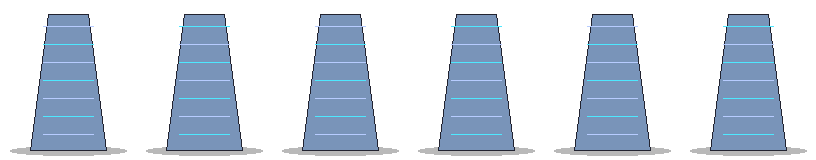
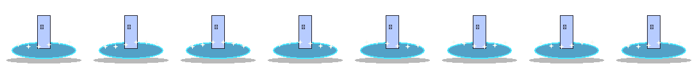
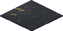
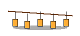
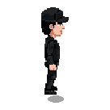
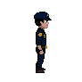
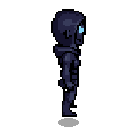
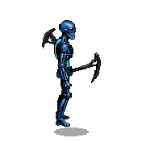
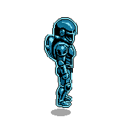

# WO-76 AI Anchor Set Candidate Audit

**HALT: Justin approval required before any anchor is committed as approved or used for runtime integration.**

- Work order: WO-76
- Status: PARTIAL_ANCHOR_APPROVAL_1_OF_10
- Runtime integration allowed: false
- Tool verdict: Use the existing noir ground bake-off verdict: repo final-paint/post-process first; use PixelLab or ComfyUI only for failures or uncovered categories after approval.

## Candidate source pools audited

| Source | Kind | Tool | Manifest | Contact sheet | Reason |
| --- | --- | --- | --- | --- | --- |
| HMH production art pass | real-generation | PixelLab + derivative animation pass | present | present | Fable Rev 2 explicitly calls this genuine generated art and requires auditing it as candidate input. |
| PixelLab Lester calibration | real-generation | PixelLab MCP/API | present | present | Fable Rev 2 calls this genuine generated art; useful for the hero bar and prompt provenance. |
| Level 1 final-paint ground | repo-owned-final-paint | repo final-paint/post-process | present | present | Matches the bake-off speed verdict for zero-credit ground candidates. |
| Level 2 final city world art | repo-owned-generated-world-art | repo-owned generated spritesheet pass | present | present | Best current city/noir-ish authored world-art pool for facade/lamp/landmark seed candidates. |
| Final setpiece kit | repo-owned-generated-setpiece-art | repo-owned generated setpiece pass | present | present | Useful seed pool for tree, lamp, prop, and micro-scene composition bars. |

## Slot contact-sheet audit

### storefront-facade — Storefront facade

- Bar: building bar
- Brief: Noodle bar facade with neon, steam vent detail, wet noir street read, no text/logos.
- Status: seeded-needs-generation
- Existing viable seed candidates: 1
- Generation deficit to minimum 12: 11

| Preview | Candidate | Source | Exists | Notes |
| --- | --- | --- | ---: | --- |
|  | level2-final-city/chrome-tower-facade | level-two-final-city | yes | Closest existing city facade seed; needs noodle-bar/neon/steam rerolls. |

### bank-deco-corner — Bank-district Deco corner facade

- Bar: landmark bar
- Brief: Art Deco financial corner facade, brass/silver/Litecoin blue, night-city rim light.
- Status: seeded-needs-generation
- Existing viable seed candidates: 2
- Generation deficit to minimum 12: 10

| Preview | Candidate | Source | Exists | Notes |
| --- | --- | --- | ---: | --- |
|  | level2-final-city/ltc-monument-fountain | level-two-final-city | yes | Financial district material/lighting seed; not yet a corner facade. |
|  | level2-final-city/chrome-tower-facade | level-two-final-city | yes | Best existing bank-tower surface seed. |

### signature-street-tree — Signature street tree

- Bar: vegetation bar
- Brief: Night-lit street tree in planter with neon spill and a distinct silhouette.
- Status: seeded-needs-generation
- Existing viable seed candidates: 1
- Generation deficit to minimum 12: 11

| Preview | Candidate | Source | Exists | Notes |
| --- | --- | --- | ---: | --- |
|  | level-final-setpiece/pine-wall-shadow | final-setpiece-kit | yes | Existing vegetation silhouette seed; not yet a city planter tree. |

### wet-asphalt-ground-family — Wet-asphalt ground family

- Bar: ground bar
- Brief: Seamless wet asphalt base plus two wear variants; painterly dense noir ground.
- Status: seeded-needs-generation
- Existing viable seed candidates: 1
- Generation deficit to minimum 12: 11

| Preview | Candidate | Source | Exists | Notes |
| --- | --- | --- | ---: | --- |
|  | final-paint/road-asphalt-handpaint-01 | level-one-final-paint-ground | yes | Zero-credit final-paint asphalt seed from the bake-off-preferred path. |

### streetlamp-light-cone — Streetlamp + pooled light cone prop

- Bar: lighting-in-sprite bar
- Brief: Streetlamp sprite with baked cone/pool of light, top-left key plus local neon rim.
- Status: seeded-needs-generation
- Existing viable seed candidates: 2
- Generation deficit to minimum 12: 10

| Preview | Candidate | Source | Exists | Notes |
| --- | --- | --- | ---: | --- |
|  | level2-final-city/plaza-streetlight-line | level-two-final-city | yes | Best existing streetlight seed; needs single-prop light-pool version. |
|  | level-final-setpiece/lantern-string | final-setpiece-kit | yes | Lighting mood seed for local glow language. |

### lit-commando-idle-key-pose — Lit Commando repaint, idle key pose

- Bar: hero bar
- Brief: Current chunky-head hero quality preserved/elevated; no restyle, single idle key pose.
- Status: seeded-needs-generation
- Existing viable seed candidates: 2
- Generation deficit to minimum 12: 10

| Preview | Candidate | Source | Exists | Notes |
| --- | --- | --- | ---: | --- |
|  | lester-iso-hero idle frame 00 | hmh-production-art-pass | yes | Current hero-quality seed; must preserve chunky-head hero proportions. |
|  | lester calibration east rotation | pixellab-calibration | yes | PixelLab prompt/provenance seed for hero bar. |

### highest-spawn-enemy-redesign — One enemy full redesign

- Bar: enemy bar
- Brief: Highest-spawn-weight enemy archetype, key pose plus attack-tell pose, fiat corruption language.
- Status: seeded-needs-generation
- Existing viable seed candidates: 2
- Generation deficit to minimum 12: 10

| Preview | Candidate | Source | Exists | Notes |
| --- | --- | --- | ---: | --- |
|  | evil-banker-ranged idle frame 00 | hmh-production-art-pass | yes | Readable enemy seed; still requires highest-spawn-weight confirmation and redesign brief. |
|  | trench-degen-chaser idle frame 00 | hmh-production-art-pass | yes | Alternate enemy seed for silhouette/faction review. |

### major-boss-key-pose — Major boss key pose

- Bar: boss bar
- Brief: Major boss at true boss scale; readable event-scale silhouette and phase-ready identity.
- Status: seeded-needs-generation
- Existing viable seed candidates: 2
- Generation deficit to minimum 12: 10

| Preview | Candidate | Source | Exists | Notes |
| --- | --- | --- | ---: | --- |
|  | chain-reaper-boss idle frame 00 | hmh-production-art-pass | yes | Existing boss seed; likely underscaled vs true WO-76 boss bar. |
|  | bit-whale-boss idle frame 00 | hmh-production-art-pass | yes | Existing major boss seed for scale/identity comparison. |

### micro-scene-composition — Micro-scene composition

- Bar: storytelling bar
- Brief: Tipped delivery cart, spilled crates, rat: authored 2-4 prop story composition.
- Status: seeded-needs-generation
- Existing viable seed candidates: 1
- Generation deficit to minimum 12: 11

| Preview | Candidate | Source | Exists | Notes |
| --- | --- | --- | ---: | --- |
|  | level-final-setpiece/wagon-circle | final-setpiece-kit | yes | Compositional setpiece seed; not the required delivery-cart/crates/rat micro-scene. |

### ui-chrome-sample — UI chrome sample

- Bar: interface bar
- Brief: Draft card frame plus HP bar segment, retro-arcade-Deco, not script-placeholder chrome.
- Status: needs-generation
- Existing viable seed candidates: 0
- Generation deficit to minimum 12: 12

_No existing real-generation candidate is eligible for this slot; generate the full 12–20 candidate batch after prompt/tool approval._

## Placeholder packs excluded from anchors

| Script | Anchor candidate eligible | Disposition |
| --- | ---: | --- |
| generate-hmh-pickup-icons.py | no | WO-90 redo queue; scaffolding only until regenerated through approved anchors |
| generate-hmh-vfx-ui-chrome.py | no | WO-90 redo queue; scaffolding only until regenerated through approved anchors |
| generate-hmh-level-one-authored-stamp-art.py | no | WO-90 redo queue; scaffolding only until regenerated through approved anchors |
| generate-hmh-achievement-atlas.py | no | WO-90 redo queue; scaffolding only until regenerated through approved anchors |

## Next approval gate

Generate or collect 12–20 candidates per slot, machine-filter them, then present numbered contact sheets. Do not integrate winners until Justin picks one winner per slot or orders rerolls.

