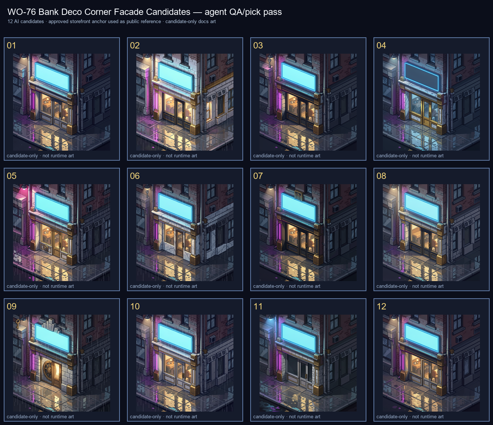

# WO-76 Bank Deco Corner Review

**Approved winner:** candidate `09`

Candidate `09` was selected as the best high-bit/noir bank-district anchor because its circular vault door and stepped Deco crown read as a financial landmark rather than a generic shopfront. Runners-up: `12`, `10`, `05`.

Anchor: `docs/art/anchors/bank-deco-corner.png`
Provenance: `docs/art/anchors/bank-deco-corner.provenance.json`
