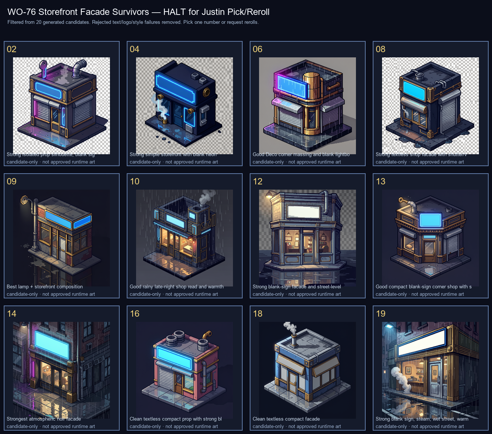

# WO-76 Storefront Facade Survivor Sheet

**HALT: Justin pick/reroll required.** These are survivor candidates for slot `storefront-facade`; none are approved anchors or runtime art.

## Survivors for review

- **02** — Strong isolated prop silhouette, blank sign, good steam/vent detail; needs crop/alpha cleanup if chosen.
- **04** — Strong simple storefront with blank neon; readable small-game prop; needs more facade/story detail if chosen.
- **06** — Good Deco corner massing and blank lightbox; slightly less noodle-specific but strong building anchor.
- **08** — Strong textless shop facade with shutter/vent/wet asphalt; good practical runtime silhouette.
- **09** — Best lamp + storefront composition; good atmosphere, slightly more general shop than noodle bar.
- **10** — Good rainy late-night shop read and warmth; may need sign cleanup/crop if chosen.
- **12** — Strong blank-sign facade and street-level shop read; perspective more front-on than 2:1 iso.
- **13** — Good compact blank-sign corner shop with steam and deco trim; solid anchor candidate.
- **14** — Strongest atmospheric noir facade; great wet reflections, but includes background street context to crop/clean.
- **16** — Clean textless compact prop with strong blank sign; less noodle-specific but good runtime readability.
- **18** — Clean textless compact facade; good runtime prop, slightly simpler than top picks.
- **19** — Strong blank sign, steam, wet street, warm interior; excellent atmosphere but needs background/crop cleanup.

## Rejected before Justin review

- **01** — Readable/fake shop text on sign; reject for no-text rule.
- **03** — Readable/fake text/signage and too much full-street illustration context; reject.
- **05** — Readable/fake shop text; reject for no-text rule.
- **07** — Readable/fake city/sign text; reject for no-text rule.
- **11** — Readable/fake shop text; reject for no-text rule.
- **15** — Clean textless candidate, but boxy/side-wall heavy and weaker as a noodle storefront than the survivor set.
- **17** — Clean textless candidate, but white-background render reads less night-noir/painterly than stronger options.
- **20** — Mostly textless, but too plain/empty and less noodle-bar-specific than stronger options.

## Requested review

Pick one survivor number, reject all, or give reroll notes. A winner still needs crop/alpha/palette cleanup and provenance recorded in `docs/art/ANCHOR_SET.md` before it becomes an approved anchor.
