# Upgrade Tree Map

<!-- Generated by scripts/generate-upgrade-tree-map.mjs. Do not hand-edit. -->

- Draft card count: 2
- Rerolls per level: 1
- Slot A: continuation, newly unlocked dependent stem, or owned-tree rank-up.
- Slot B: fresh new tree, falling back to a second continuation only when no new tree remains.

```mermaid
flowchart LR
  skill_damage_alpha["Damage Alpha<br/>universal base<br/>max r5"]
  skill_reload_hands["Reload Hands<br/>universal base<br/>max r4"]
  skill_move_speed["Street Runner<br/>universal base<br/>max r4"]
  skill_magazine_size["Deep Mags<br/>universal base<br/>max r4"]
  skill_rate_of_fire["Hashrate Fire<br/>universal base<br/>max r5"]
  skill_pickup_radius["Magnet Wallet<br/>universal base<br/>max r4"]
  skill_max_health["Cold Storage<br/>universal base<br/>max r4"]
  skill_critical_chance["Crit Candle<br/>universal base<br/>max r4"]
  skill_critical_damage["Crit Multiplier<br/>dependent stem<br/>max r4"]
  skill_projectile_speed["Tracer Velocity<br/>level-gated base<br/>max r4"]
  skill_pierce["Piercing Ledger<br/>dependent stem<br/>max r4"]
  skill_spread_control["Spread Control<br/>level-gated base<br/>max r4"]
  skill_grenade_capacity["Nade Pockets<br/>level-gated base<br/>max r4"]
  skill_armor["Cold Armor<br/>level-gated base<br/>max r4"]
  skill_grenade_damage["Frag Yield<br/>dependent stem<br/>max r4"]
  skill_grenade_radius["Blast Radius<br/>dependent stem<br/>max r4"]
  skill_xp_gain["Wisdom Candles<br/>level-gated base<br/>max r4"]
  skill_power_up_luck["Green Luck<br/>level-gated base<br/>max r4"]
  skill_dash_cooldown["Dash Clock<br/>level-gated base<br/>max r4"]
  skill_launcher_rig["Launcher Rig<br/>unlock stem<br/>max r1"]
  skill_dash_distance["Gap Runner<br/>dependent stem<br/>max r4"]
  skill_health_regen["Self Custody<br/>dependent stem<br/>max r4"]
  skill_coin_value["Hard Money<br/>level-gated base<br/>max r4"]
  skill_combo_retention["Diamond Combo<br/>level-gated base<br/>max r4"]
  skill_homing_cluster["Homing Cluster<br/>unlock stem<br/>max r1"]
  skill_block_buster["Block Buster<br/>unlock stem<br/>max r1"]
  skill_evolve_settler_rail["Settler Rail Dividend<br/>golden evolution<br/>max r1"]
  skill_evolve_hashstorm_overdrive["Hashstorm Overdrive<br/>golden evolution<br/>max r1"]
  skill_evolve_crit_candle["Golden Crit Candle<br/>golden evolution<br/>max r1"]
  skill_evolve_crypto_bomb_orbit["Crypto Bomb Orbit<br/>golden evolution<br/>max r1"]
  skill_revive["Second Wallet<br/>unlock stem<br/>max r1"]
  skill_critical_chance -- "r1" --> skill_critical_damage
  skill_damage_alpha -- "r1" --> skill_pierce
  skill_grenade_capacity -- "r1" --> skill_grenade_damage
  skill_grenade_capacity -- "r1" --> skill_grenade_radius
  skill_dash_cooldown -- "r2" --> skill_dash_distance
  skill_max_health -- "r2" --> skill_health_regen
  skill_grenade_damage -- "r2" --> skill_homing_cluster
  skill_grenade_radius -- "r2" --> skill_block_buster
  skill_damage_alpha -- "r5" --> skill_evolve_settler_rail
  skill_pierce -- "r4" --> skill_evolve_settler_rail
  skill_rate_of_fire -- "r3" --> skill_evolve_settler_rail
  skill_rate_of_fire -- "r5" --> skill_evolve_hashstorm_overdrive
  skill_magazine_size -- "r4" --> skill_evolve_hashstorm_overdrive
  skill_reload_hands -- "r3" --> skill_evolve_hashstorm_overdrive
  skill_critical_chance -- "r4" --> skill_evolve_crit_candle
  skill_critical_damage -- "r4" --> skill_evolve_crit_candle
  skill_projectile_speed -- "r3" --> skill_evolve_crit_candle
  skill_grenade_damage -- "r4" --> skill_evolve_crypto_bomb_orbit
  skill_grenade_radius -- "r4" --> skill_evolve_crypto_bomb_orbit
  skill_grenade_capacity -- "r4" --> skill_evolve_crypto_bomb_orbit
  skill_max_health -- "r3" --> skill_revive
  skill_armor -- "r2" --> skill_revive
  level_5((Level 5+)) --> skill_projectile_speed
  level_5((Level 5+)) --> skill_spread_control
  level_5((Level 5+)) --> skill_grenade_capacity
  level_5((Level 5+)) --> skill_armor
  level_10((Level 10+)) --> skill_xp_gain
  level_10((Level 10+)) --> skill_power_up_luck
  level_10((Level 10+)) --> skill_dash_cooldown
  level_10((Level 10+)) --> skill_launcher_rig
  level_15((Level 15+)) --> skill_coin_value
  level_15((Level 15+)) --> skill_combo_retention
```

## Review Table

| Skill | Kind | Gate | Max Rank | Category |
|---|---:|---|---:|---|
| Damage Alpha `damage-alpha` | universal base | start-anytime | 5 | damage |
| Reload Hands `reload-hands` | universal base | start-anytime | 4 | reload-speed |
| Street Runner `move-speed` | universal base | start-anytime | 4 | movement-speed |
| Deep Mags `magazine-size` | universal base | start-anytime | 4 | magazine-size |
| Hashrate Fire `rate-of-fire` | universal base | start-anytime | 5 | fire-rate |
| Magnet Wallet `pickup-radius` | universal base | start-anytime | 4 | pickup-magnet |
| Cold Storage `max-health` | universal base | start-anytime | 4 | max-hp |
| Crit Candle `critical-chance` | universal base | start-anytime | 4 | crit-chance |
| Crit Multiplier `critical-damage` | dependent stem | level 5+, critical-chance r1 | 4 | crit-damage |
| Tracer Velocity `projectile-speed` | level-gated base | level 5+ | 4 | projectile-speed |
| Piercing Ledger `pierce` | dependent stem | level 5+, damage-alpha r1 | 4 | pierce |
| Spread Control `spread-control` | level-gated base | level 5+ | 4 | spread-control |
| Nade Pockets `grenade-capacity` | level-gated base | level 5+ | 4 | grenade-capacity |
| Cold Armor `armor` | level-gated base | level 5+ | 4 | armor |
| Frag Yield `grenade-damage` | dependent stem | level 10+, grenade-capacity r1 | 4 | grenade-damage |
| Blast Radius `grenade-radius` | dependent stem | level 10+, grenade-capacity r1 | 4 | grenade-radius |
| Wisdom Candles `xp-gain` | level-gated base | level 10+ | 4 | xp-gain |
| Green Luck `power-up-luck` | level-gated base | level 10+ | 4 | power-up-luck |
| Dash Clock `dash-cooldown` | level-gated base | level 10+ | 4 | dash-cooldown |
| Launcher Rig `launcher-rig` | unlock stem | level 10+ | 1 | throwable |
| Gap Runner `dash-distance` | dependent stem | level 15+, dash-cooldown r2 | 4 | dash-distance |
| Self Custody `health-regen` | dependent stem | level 15+, max-health r2 | 4 | hp-regen |
| Hard Money `coin-value` | level-gated base | level 15+ | 4 | coin-value |
| Diamond Combo `combo-retention` | level-gated base | level 15+ | 4 | combo-retention |
| Homing Cluster `homing-cluster` | unlock stem | level 15+, grenade-damage r2 | 1 | throwable |
| Block Buster `block-buster` | unlock stem | level 15+, grenade-radius r2 | 1 | throwable |
| Settler Rail Dividend `evolve-settler-rail` | golden evolution | level 18+, damage-alpha r5, pierce r4, rate-of-fire r3 | 1 | weapon-evolution |
| Hashstorm Overdrive `evolve-hashstorm-overdrive` | golden evolution | level 18+, rate-of-fire r5, magazine-size r4, reload-hands r3 | 1 | weapon-evolution |
| Golden Crit Candle `evolve-crit-candle` | golden evolution | level 18+, critical-chance r4, critical-damage r4, projectile-speed r3 | 1 | weapon-evolution |
| Crypto Bomb Orbit `evolve-crypto-bomb-orbit` | golden evolution | level 18+, grenade-damage r4, grenade-radius r4, grenade-capacity r4 | 1 | weapon-evolution |
| Second Wallet `revive` | unlock stem | level 20+, max-health r3, armor r2 | 1 | defense |

