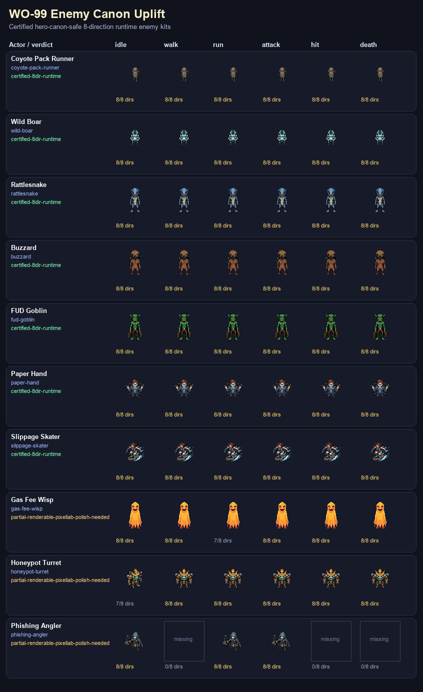
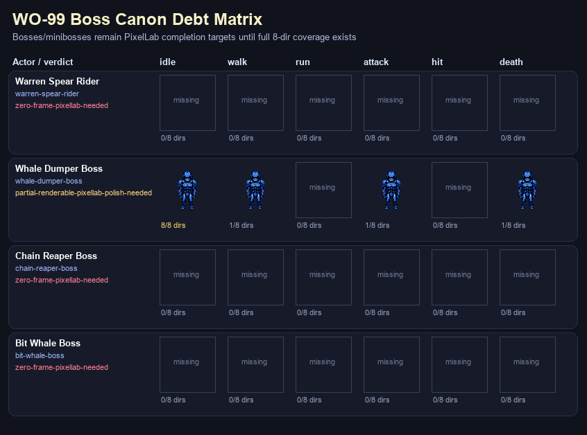

# WO-99 — Enemy/Boss Canon Uplift

**Status:** runtime enemy uplift complete; boss debt matrix explicit.  
**Generated by:** `scripts/build-hmh-wo99-enemy-canon-uplift.py`

## Summary

- Runtime enemy kits inspected: **32**
- Hero-canon-safe certified enemy kits: **7**
- Boss candidates inspected: **4**
- Bosses needing complete PixelLab 8-dir kits before live boss selection: **4**
- PixelLab status checked during WO-99: active Tier 3, **10,000 generations remaining**.

## Contact / spectacle sheets

- Enemy canon sheet: `docs/game-design/assets/hmh-wo99-enemy-canon-contact-sheet.png`
- Boss debt sheet: `docs/game-design/assets/hmh-wo99-boss-canon-debt-sheet.png`

## Certified enemy IDs

`coyote-pack-runner`, `wild-boar`, `rattlesnake`, `buzzard`, `fud-goblin`, `paper-hand`, `slippage-skater`

## Enemy matrix

| Enemy | Roster key | Verdict | Full 8-dir core states |
| --- | --- | --- | --- |
| `coyote-pack-runner` | `coyote-pack-runner` | certified-8dir-runtime | idle, walk, run, attack, hit, death |
| `wild-boar` | `wild-boar` | certified-8dir-runtime | idle, walk, run, attack, hit, death |
| `rattlesnake` | `rattlesnake` | certified-8dir-runtime | idle, walk, run, attack, hit, death |
| `buzzard` | `buzzard` | certified-8dir-runtime | idle, walk, run, attack, hit, death |
| `fud-goblin` | `fud-goblin` | certified-8dir-runtime | idle, walk, run, attack, hit, death |
| `paper-hand` | `paper-hand` | certified-8dir-runtime | idle, walk, run, attack, hit, death |
| `slippage-skater` | `slippage-skater` | certified-8dir-runtime | idle, walk, run, attack, hit, death |
| `gas-fee-wisp` | `gas-fee-wisp` | partial-renderable-pixellab-polish-needed | idle, walk, attack, hit, death |
| `honeypot-turret` | `honeypot-turret` | partial-renderable-pixellab-polish-needed | walk, run, attack, hit, death |
| `phishing-angler` | `phishing-angler` | partial-renderable-pixellab-polish-needed | idle, run, attack |
| `bridge-exploiter` | `bridge-exploiter` | partial-renderable-pixellab-polish-needed | idle, run, attack |
| `plaza-warden` | `plaza-warden` | defer-or-repair-until-complete | run, hit, death |
| `sybil-drone` | `sybil-drone` | partial-renderable-pixellab-polish-needed | idle, run, attack |
| `the-obfuscator` | `the-obfuscator` | defer-or-repair-until-complete | hit, death |
| `rug-rat` | `rug-rat` | defer-or-repair-until-complete | idle, run, hit |
| `fud-goblin-cave` | `trench-degen` | defer-or-repair-until-complete | idle, walk |
| `nft-valet` | `nft-valet` | defer-or-repair-until-complete | attack |
| `scam-cult-zealot` | `scam-cult-zealot` | defer-or-repair-until-complete | run |
| `bitcoin-maximalist-riot-cop` | `bitcoin-maximalist-riot-cop` | defer-or-repair-until-complete | attack |
| `claim-jumper` | `claim-jumper` | defer-or-repair-until-complete | none |
| `claim-jumper-sheriff` | `claim-jumper` | defer-or-repair-until-complete | none |
| `mev-reaper` | `mev-reaper` | defer-or-repair-until-complete | run |
| `scorpion-ambusher` | `scorpion-ambusher` | defer-or-repair-until-complete | death |
| `influencer-camera-drone` | `influencer-camera-drone` | defer-or-repair-until-complete | none |
| `stablecoin-socialite` | `stablecoin-socialite` | defer-or-repair-until-complete | idle |
| `bandit-captain` | `evil-banker-ranged` | zero-frame-pixellab-needed | none |
| `crypto-bro` | `crypto-bro-rusher` | zero-frame-pixellab-needed | none |
| `dao-lobbyist` | `dao-lobbyist` | missing-roster | none |
| `evil-banker` | `evil-banker-ranged` | zero-frame-pixellab-needed | none |
| `gas-beast` | `gas-beast-tank` | zero-frame-pixellab-needed | none |
| `liquidation-cascade-golem` | `liquidation-cascade-golem` | zero-frame-pixellab-needed | none |
| `ridge-raider` | `evil-banker-ranged` | zero-frame-pixellab-needed | none |

## Boss matrix

| Boss | Roster key | Verdict | Action |
| --- | --- | --- | --- |
| Warren Spear Rider | `warren-spear-rider` | zero-frame-pixellab-needed | queue-complete-8dir-boss-kit |
| Whale Dumper Boss | `whale-dumper-boss` | partial-renderable-pixellab-polish-needed | queue-complete-8dir-boss-kit |
| Chain Reaper Boss | `chain-reaper-boss` | zero-frame-pixellab-needed | queue-complete-8dir-boss-kit |
| Bit Whale Boss | `bit-whale-boss` | zero-frame-pixellab-needed | queue-complete-8dir-boss-kit |

## Runtime decision

WO-99 supersedes the older WO-52 generation halt because Justin explicitly approved PixelLab usage. The live uplift made the real 8-direction `buzzard` kit available instead of the former proxy path. Bosses are not over-claimed: any boss row without complete 8-direction state coverage remains in the PixelLab completion queue/debt matrix until a future generation pass produces and verifies the missing frames.
