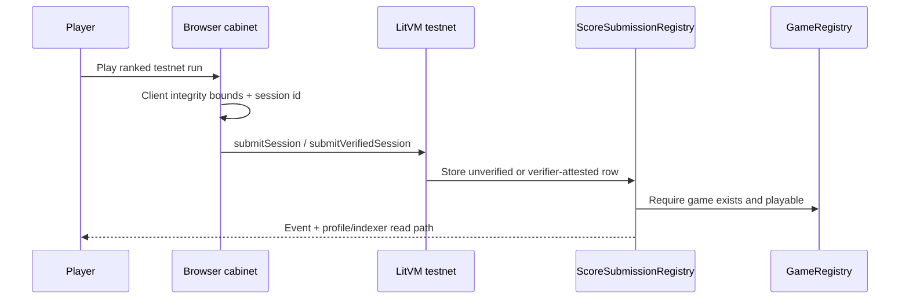

# Settlement Architecture Decision

Status: **HALT pending Justin ruling for WO-115**.

## Decision to record

The security handoff requires Justin to choose the canonical settlement path before deployment work:

- **Recommended path B now, path A later:** Testnet MVP uses hardened `ScoreSubmissionRegistry` plus locked-down `ArcadePaymentRouter` with paid entry disabled while ranked remains free. `SessionLedger + PaymentRouter` stays in-tree, fully fixed and tested, but is not deployed until paid ranked launches.
- **Alternative path A now:** Deploy the escrow-oriented `SessionLedger + PaymentRouter` stack immediately with zero-fee sessions.

No testnet redeploy may proceed until this file records Justin's explicit ruling.

## Current implementation inventory at remediation start

Current HEAD before this remediation exposed two settlement/payment paths:

1. **Path A, escrow/future paid ranked:**
   - `contracts/src/SessionLedger.sol`
   - `contracts/src/PaymentRouter.sol`
   - Intended flow: player opens paid session, fee escrowed in `SessionLedger`, adapter-signed close commits score, `settle()` atomically routes fee via `PaymentRouter`.
   - Current verdict before fixes: vulnerable/incomplete per CRITICAL-1, CRITICAL-2, CRITICAL-4, HIGH-1, HIGH-2, HIGH-3.

2. **Path B, current testnet submitted-score path:**
   - `contracts/src/ScoreSubmissionRegistry.sol`
   - `contracts/src/ArcadePaymentRouter.sol`
   - Intended testnet flow: player submits own ranked score, paid entry is disabled while ranked is free, future verifier attestation can mark rows verified.
   - Current verdict before fixes: vulnerable/incomplete per CRITICAL-3, HIGH-4, HIGH-6, HIGH-8, MEDIUM-1.

## Recommended trust model once WO-115 is approved

- Players sign and pay their own testnet gas.
- Until the verifier tier is active, score rows are **unverified** and carry no value.
- `GameRegistry` is the source of game existence/playability, dev wallet, split data, and trusted verifier.
- Any paid-entry path must be operator-enabled and registry-derived; players must not supply routing destinations.

## Testnet beta disclosure/reset policy draft

Draft copy pending Justin approval:

> Ranked testnet boards are beta. Scores are submitted by players and protected by client integrity checks, but they are not yet cheat-proof on-chain. No prizes or value attach to these boards. We may reset leaderboards during the WO-131 security redeploy and will archive the pre-reset board for transparency.

Reset policy pending Justin approval:

- WO-131 may reset the testnet score registry when the canonical hardened deployment is approved.
- If reset occurs, the old leaderboard snapshot is archived under `docs/archive/leaderboards-pre-security-<date>.json` before new contract addresses go live.
- UI copy must announce the reset before or alongside the deployment record.

## Explicit non-actions

- No mainnet deployment is in scope.
- No testnet deployment may proceed without a separate HALT approval showing contracts, constructor args, addresses, gas estimate, and migration/reset impact.
